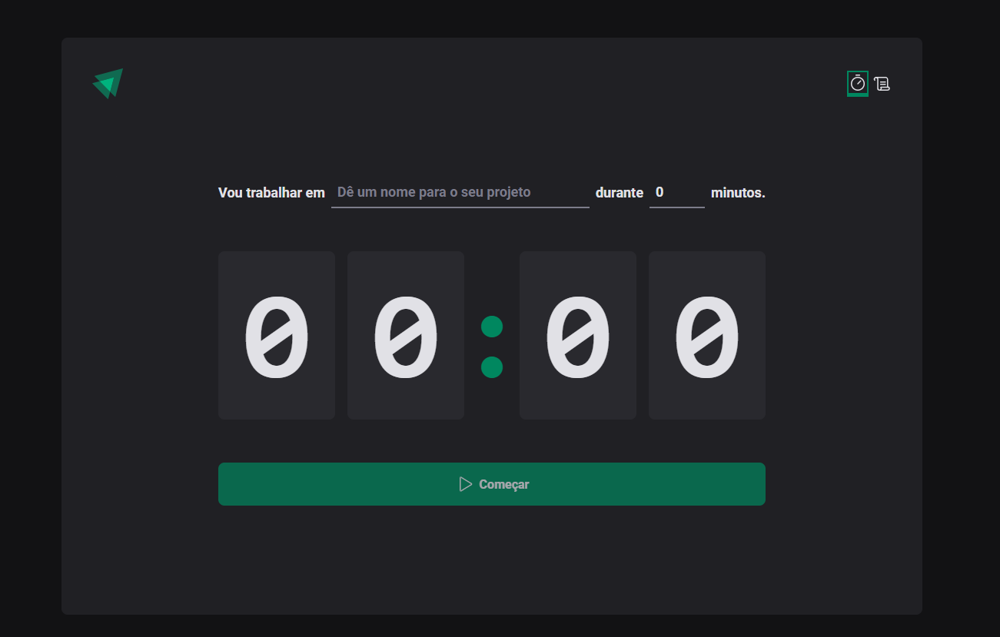
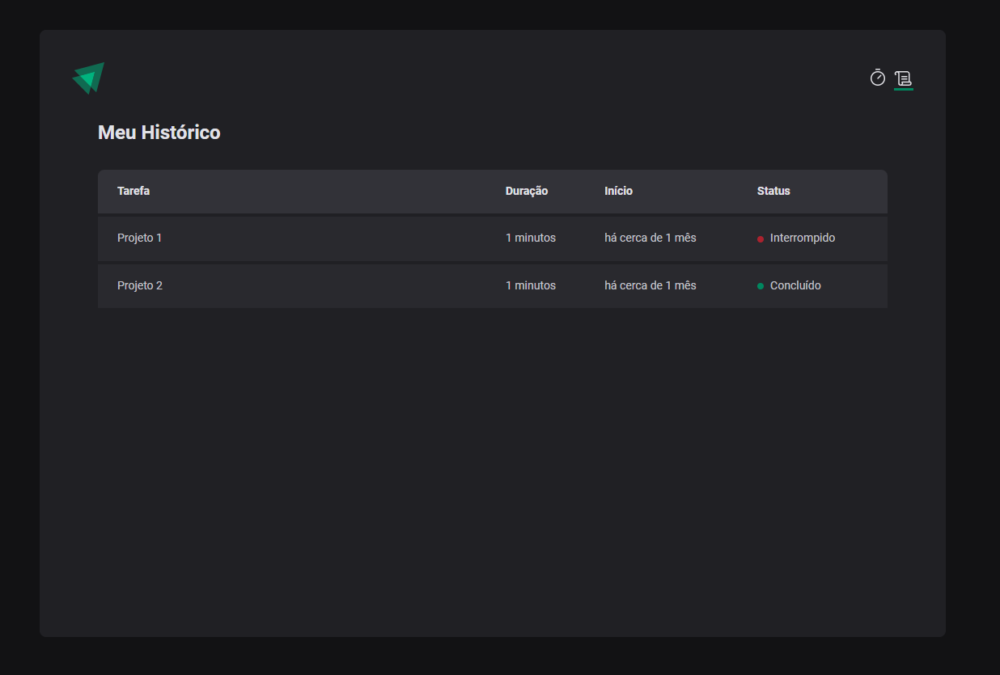

# Ignite Timer


This is a Pomodoro Application. Basically the person will type in which task they will start working on, for how long, and the timer will start running from there.

## Layout

To see the complete layout: [figma](<https://www.figma.com/file/YqJC33tVzBSwFXxBpez52g/ToDo-List-%E2%80%A2-Desafio-React-(Copy)?type=design&node-id=4130-459&mode=design&t=pdVUT0FejANNKUEQ-0>)

<!-- image -->

<div align="center" style="display:flex">
    
    
</div>

## Features

 - [x] Add a new task
 - [x] Set the pomodoro (interval) time
 - [x] Start a pomodoro
 - [x] Show time passing
 - [x] Show the Stop button when pomodoro is running
 - [x] When the timer ends, the fields will be able to start again
 - [x] On the history page it shows all pomodoros (in progress, complete, interrupted)

## What was used ?

The project was created on react

- [x] ReactJs
- [x] React Hooks
- [x] React Hook Forms
- [x] Styled Components
- [x] Typescipt
- [x] Context API
- [x] Reducers

## For Run

With YARN:

```
yarn
yarn dev
```

With NPM

```
npm install
npm run dev
```


## Meta

Author - Rockeseat.

programmer - [Fernando Futila] - fernando.futila@gmail.com

---

Done with 💜 by Fernando Futila 👋🏻
